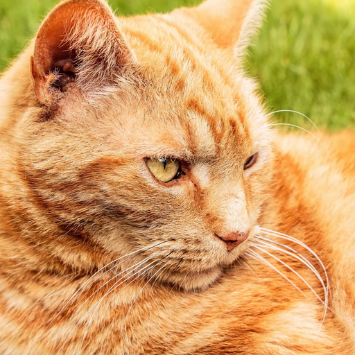
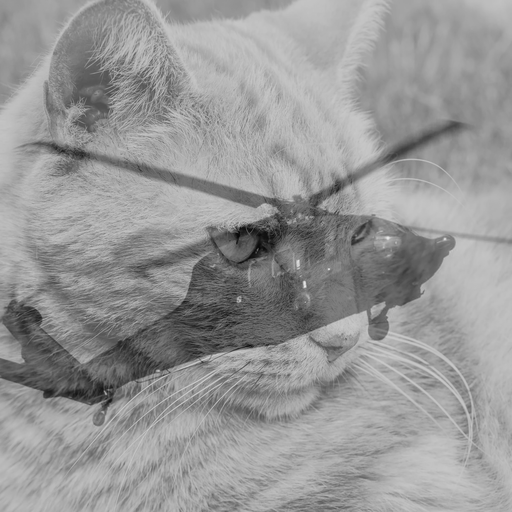

# NVFLARE Federated Learning File Transfer Demo

This project is an **NVFLARE** application that demonstrates **basic federated learning** and the ability to **transfer files as messages** between participants in a simulated federated environment.

The code in this repository generates a Docker Image that serves as a **computation module compatible with NeuroFlame**.

https://github.com/NVIDIA/NVFlare  
https://github.com/trendscenter/NeuroFLAME/  
https://github.com/trendscenter/mint-computation-nvflare-app-boilerplate  

## **Overview**
This application:
- Uses **NVFLARE** to simulate a federated learning setup with multiple sites.
- Transfers **image files** as messages between clients and the server.
- Performs **pixel-wise image aggregation** by averaging grayscale images.
- Produces a **resulting aggregated image** after federation.

## **Example Results**
- **Input images from clients:**
  - 
  - 
- **Resulting aggregated image:**
  - 

---

## **Setup & Execution**

### **1. Build the Development Docker Image**
```sh
docker build -t nvflare-dev -f Dockerfile-dev .
```

### **2. Run the NVFLARE Container**
```sh
./dockerRun.sh
```

### **3. Inside the Container: Run the NVFLARE Simulator**
The simulator runs a **federated learning job** with two sites (**site1** and **site2**).
```sh
nvflare simulator -c site1,site2 ./app
```

### **4. View the Results**
Once the job completes, view the aggregated image results:
```sh
./test_results/simulate_job
```

---

## **Using Additional Images**
If you want to add more images beyond the existing ones, use the `batch_resize` script on the `test_images` folder to ensure they are properly formatted. Once resized, place the chosen images into `./test_data/sitename` for use in federation.

---

## **Notes**
- This example is designed for **grayscale BMP images**.
- Ensure that images are correctly formatted before running federation.
- Modify the **aggregator** if you want to support color images or different aggregation strategies.